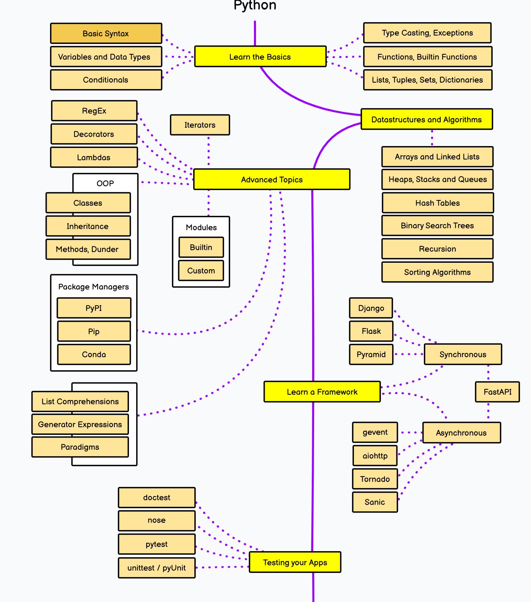

:::tip About Lessons

Each Lesson has a Lab and an HTML link. 
- The first is an executable Jupyter notebook for interactive learning. You must open this in Visual Studio Code with a suitable runtime (e.g., GitHub Codespaces). It cannot be viewed in a browser.
- The second is a static HTML version of the notebook suitable for viewing in a browser. To view it within Visual Studio Code use `<kbd>Ctrl</kbd>+<kbd>K</kbd>, <kbd>V</kbd>`.

:::

<!-- 
Use this command to convert a notebook in a folder to HTML and save it in the public folder.
jupyter nbconvert --output-dir ./../../../../public/notebooks --to html <notebook-name.ipynb> 
-->

## Roadmap

For this bucket, I'll start by following the broad outlines of the [Python Developer Roadmap](https://roadmap.sh/python) shown below (captured Apr 2024). Please refer to the source for the latest version. Each box has a list of relevant resources that I will use as a starting point.

Let's Follow the 

| Notebook | Web View | Description |
|---|---|---|
| [Lab 01](./100-01.ipynb) | [HTML](./../../../../public/notebooks/100-01.html) | **Getting Started.** Use this lab to validate your development environment is setup correctly. Learn to use Jupyter Notebooks, invoke commands from Python cells, and run commands from a VS Code terminal. |
| Lab 02 | HTML | **Learn The Basics**. Basic Syntax. Variables & Data Types. Conditionals. Type Casting & Exceptions. Functions & Built-in Functions. Lists, Tuples, Sets & Dictionaries. |
| Lab 03 | HTML | **Data Structures and Algorithms**. Arrays. Linked Lists. Heaps, Stacks & Queues. Hash Tables. Binary Search Trees. Recursion. Sorting Algorithms. |
| Lab 04 | HTML | **Advanced Topics I**. Iterators. RegEx. Decorators. Lambdas. |
| Lab 05 | HTML | **Object Oriented Programming.** Classes. Inheritance. Methods. Dunder.   |
| Lab 06 | HTML | **Modules.** Built-in Modules. Custom Modules. |
| Lab 07 | HTML | **Package Managers**. PyPi. Pip. Conda.  | 
| Lab 08 | HTML | **Advanced Topics II.** List Comprehensions. Generator Expressions. Paradigms.|
| Lab 09 | HTML | **Testing**. doctest. nose. pytest. unittest/pyUnit. Playwright. | 
| Lab 07 | HTML | **Miscellaneous**. Developer Tools. Best Practices. End-to-End Workflows.  | 
| | | |

 

## Resources 

This will be an evolving set of resources as labs are completed.

| Resource | Source | Description |
|---|---|---|
| [Python Developer Roadmap](https://roadmap.sh/python) | Roadmap.sh | Python Developer Roadmap. |
| [Python 3 Documentation](https://docs.python.org/3/) | Python.org | Official Python 3 Documentation. |
| [Learn on Kaggle](https://www.kaggle.com/learn/) | Kaggle | Python - Intro to ML - Pandas - Data Viz - Deep Learning etc. |
| [Python 3 Specialization](https://www.coursera.org/specializations/python-3-programming) | Coursera | Python 3 Programming Specialization from U.Mich (5 courses). |
| | | |
